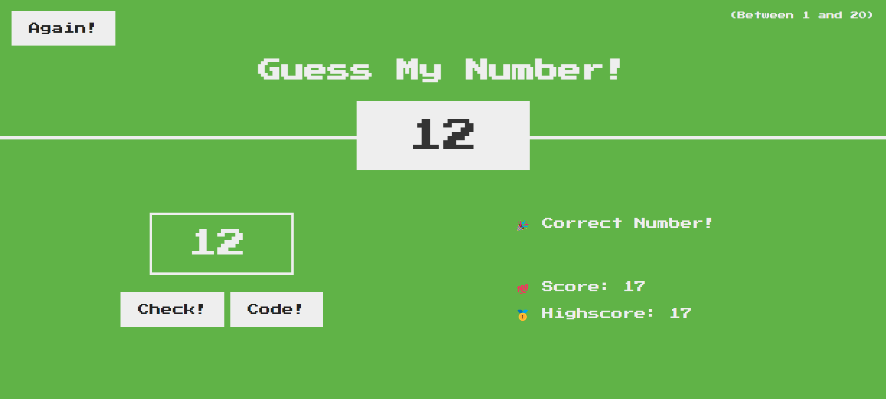

# Guess My Number Game

Welcome to Guess My Number Game! This is a simple number guessing game where you try to guess a secret number between 1 and 20.

## How to Play

1. Enter your guess in the input field.
2. Click the "Check!" button to see if your guess is correct.
3. Keep guessing until you find the correct number.
4. Your score decreases with each incorrect guess.
5. Beat your highest score!

## Instructions

-   If your guess is correct, the background turns green and you win.
-   If your guess is higher than the secret number, you'll be prompted with "📈 Too high!"
-   If your guess is lower than the secret number, you'll be prompted with "📉 Too low!"
-   If you lose all your chances, the game will end.

## Try Again

Don't worry if you lose! You can always click the "Again!" button to start a new game.

## Enjoy the Game!

Have fun playing Guess My Number and challenge your friends to beat your high score!

